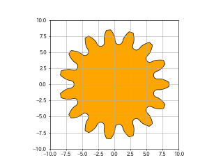

# gear
- 歯車創成:　gear_profile.py
- 使い方
- 遊星ギア機構のデモ: planetary_gear.py
- 不思議歯車機構のデモ: fushigi.py and fushigi_1.py
# 歯車創成
```
class Gear(hasuu, mo, shift, hasaki, hazoko, fig='hira')
  hasuu:歯車の歯数　(integer)
  shift:転移係数(float)
  hasaki:歯先直径(float)
  hazoko:歯底直径(float)
  fig:歯車形状(string)　default:'hira'平歯車　'hira'以外の文字列は内歯車
property:
  x:nd.array 歯車形状　x座標
  y:nd.array 歯車形状　y座標
  
その他関数
  make_param(m, z1, x1, fig1, z2, x2, fig2)
    m:モジュール(float)
    z1:歯車1の歯数integer
    x1:歯車1の転移係数float
    fig1:string
    z2:歯車1の歯数integer
    x2:歯車1の転移係数float
    fig2:string
    戻り値 list
      (軸間距離、歯車1諸元class Gearのパラメータ, 歯車2諸元class Gearのパラメータ)
```
# 使い方
```
import matplotlib.patches as mpatches
import matplotlib.pyplot as plt
import numpy as np
from matplotlib.path import Path

import gear_profile as gear

mo = 1.
z1 = 15
x1 = 0.
hasaki = 17.
hazoko = 12.5
fig1 = 'hira'
g = gear.Gear(z1, mo, x1, hasaki, hazoko, 'hira')
xy = np.column_stack((g.x, g.y))
fig, ax = plt.subplots()
ax.grid()
ax.set_aspect('equal')
ax.set_xlim(-10, 10)
ax.set_ylim(-10, 10)
patch = mpatches.PathPatch(
    Path(xy, g.code),
    facecolor='orange', edgecolor='black')
ax.add_patch(patch)
plt.show()
```

# fushigi.py デモ

         